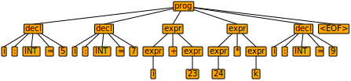

# ANTLR Calculator Demo

This is a recreation of the source code for the [ANTLR](https://www.antlr.org/) based application created during the
video tutorial by Jackie Wang:

https://www.eecs.yorku.ca/~jackie/teaching/tutorials/index.html#antlr4_parser_generator

The current code is exactly the same. The only two differences are that the project:

- is [Maven](https://maven.apache.org/) based
- uses [Spring Boot](https://spring.io/projects/spring-boot) to run the app as an executable jar

## Quickstart

Build the project using the provided Maven-wrapper:

```bash
./mvnw clean package
```

Run the application:

```bash
java -jar target/calculator-0.0.1-SNAPSHOT.jar src/main/resources/test2.txt
```

This should yield the following output:

```bash
i is 5
j is 7
i + j is 12
i * j is 35
i + j * 3 is 26
i * j + 3 is 38
```

## The details of running ANTLR4

On Mac, let's install the `antlr` command-line support using [Homebrew](https://brew.sh/):

```bash
brew install antlr
```

Go to the director where the `Expr.g4` file is located:

```
cd src/main/resources
```

Generate ANTLR classes by executing:

```
antlr -o ../java/com/hillert/calculator/antlr -no-listener Expr.g4
```

Run `grun`, the ANTLR TestRig

Compile code:

```bash
./mvnw compile
```

```
cd target/classes
grun com.hillert.calculator.antlr.Expr prog ../../src/main/resources/test0.txt -gui
```



Generate Parser Classes:

```bash
cd src/main/resources
antlr -visitor Expr.g4 -o ../java/com/hillert/calculator/antlr
```
